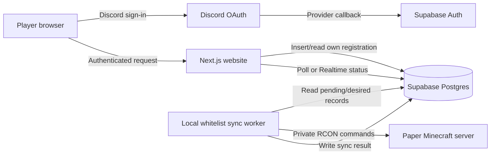

# Chulacraft Web Registration and Minecraft Whitelist

## Product requirements document

| Field | Value |
| --- | --- |
| Status | Draft ready for implementation |
| Product | Chulacraft player registration website |
| Repository path | `IMPLEMENTPLAN/webforregister` |
| Server | Paper Java Edition 1.21.11 |
| Authentication | Discord OAuth through Supabase Auth |
| Database | Supabase Postgres |
| Server integration | Local synchronization worker using RCON |
| Last updated | 2026-07-27 |

## 1. Executive summary

Chulacraft needs a small website where a player:

1. signs in with Discord;
2. submits their Minecraft Java Edition username; and
3. waits until the website confirms that the Minecraft server has whitelisted them.

Every successful registration must be stored in Supabase and applied to the running Paper server. Supabase is the durable source of truth. A local worker running beside the Minecraft Docker container reads registrations from Supabase and changes the live whitelist through RCON.

The worker is necessary because the website may be hosted on Vercel or another public host that cannot safely connect to the RCON port on the home server. RCON remains private. The worker also makes the system recoverable: if the Minecraft server is offline during registration, the database keeps the request and the worker applies it automatically on the next startup.

“Registration complete” has a precise meaning:

- `pending`: the database accepted the registration, but the server has not confirmed it yet;
- `synced`: the database record exists and the server confirmed `whitelist add`;
- `failed`: the last sync attempt failed, but the worker will retry automatically.

The UI must not claim that registration is complete until the state is `synced`.

## 2. Current repository state

This PRD is based on the repository as inspected on 2026-07-27.

- `IMPLEMENTPLAN/webforregister/idea` exists but is empty.
- There is not yet a web application in `IMPLEMENTPLAN/webforregister`.
- The root `.env` currently contains Minecraft settings only. It does **not** currently contain a Supabase URL or key.
- The current `.gitignore` ignores `.env`, but it does **not** yet ignore `.env.local`.
- The current Docker image enables RCON.
- Compose exposes RCON only on `127.0.0.1:25575`, which is the correct safe default.
- `data/server.properties` currently has `white-list=false` and `enforce-whitelist=false`.
- `data/whitelist.json` is currently empty.
- The server has `online-mode=true`, so this product is for real Minecraft Java Edition accounts.

The environment variable name `NEXT_PUBLIC_SUPABASE` is not sufficient by itself. The Next.js app needs:

```env
NEXT_PUBLIC_SUPABASE_URL=https://your-project-ref.supabase.co
NEXT_PUBLIC_SUPABASE_PUBLISHABLE_KEY=sb_publishable_xxx
```

The local sync worker additionally needs a backend-only Supabase secret:

```env
SUPABASE_SECRET_KEY=sb_secret_xxx
```

A legacy `SUPABASE_SERVICE_ROLE_KEY` can be supported if the project does not yet provide a new secret key. Neither secret may ever use a `NEXT_PUBLIC_` prefix or be included in browser code.

## 3. Product decisions for the MVP

| Question | MVP decision |
| --- | --- |
| Who can register? | Any user who successfully signs in through Discord |
| Minecraft edition | Java Edition only |
| Account relationship | One Discord account can register one Minecraft UUID; one Minecraft UUID can belong to one Discord account |
| Username case | Case-insensitive for uniqueness; store the canonical capitalization returned by the account lookup |
| Database or server first? | Database first, then idempotent server synchronization |
| Server unavailable | Save the registration as pending/failed and retry automatically |
| RCON access | Local worker only; never expose RCON to the public Internet or browser |
| Startup behavior | Enable the whitelist, then add every database record whose desired state is whitelisted |
| Changes while running | Worker polls regularly and applies new registrations without a server restart |
| Existing manual entries | Do not remove them during MVP reconciliation |
| Admin removal | Admin marks a database record as not desired; worker removes that known player |
| Self-service username change | Out of scope for MVP |
| Proof of Minecraft ownership | Existence check only in MVP; stronger ownership verification is a later enhancement |

## 4. Problem statement

Today, an operator must manually identify a Discord user, copy their Minecraft username, and run a whitelist command. This creates delays, spelling mistakes, duplicate claims, and no reliable record of who was approved. Restarting or rebuilding the server can also leave the database and live whitelist inconsistent.

The product must provide one simple registration path and one durable audit record while keeping privileged server and database credentials off the public website.

## 5. Goals

### 5.1 Primary goals

- Let a player authenticate using Discord only.
- Validate and register one real Minecraft Java Edition profile.
- Store the Discord-to-Minecraft association in Supabase.
- Add the Minecraft profile to the live server whitelist.
- Restore all desired database registrations whenever the server stack starts.
- Show an honest, understandable status to the player.
- Recover automatically from temporary Supabase, profile lookup, Docker, network, or RCON failures.
- Protect Supabase secrets, RCON credentials, and other players’ data.

### 5.2 Success measures

- At least 95% of valid registrations reach `synced` within 30 seconds while the server and external services are healthy.
- 100% of desired registrations are present on the live whitelist after a successful startup reconciliation.
- Duplicate Discord accounts or duplicate Minecraft UUIDs never create a second active registration.
- No secret key or RCON password appears in a client-side JavaScript bundle, response body, or repository commit.
- A temporary server outage does not lose an accepted registration.

## 6. Non-goals for the MVP

- Minecraft Bedrock support.
- Microsoft/Minecraft OAuth.
- Cryptographic proof that the Discord user owns the submitted Minecraft account.
- A public player directory.
- Payments, subscriptions, roles, ranks, or LuckPerms integration.
- Automatic Discord server role assignment.
- A full admin dashboard.
- Player self-service replacement or deletion of a registered Minecraft account.
- Starting or stopping the Minecraft server from the website.
- Public access to RCON.

## 7. Users and roles

### Player

- Signs in with Discord.
- Submits a Minecraft Java Edition username.
- Sees their own registration and synchronization state.
- Can sign out.

### Server operator

- Configures Discord, Supabase, deployment URLs, and local secrets.
- Starts and monitors the Docker stack.
- Can inspect or revoke registrations directly in Supabase during MVP.
- Can inspect worker logs without exposing secrets.

### Local sync worker

- Uses a backend-only Supabase secret.
- Reads registrations that require an add or removal.
- Uses private RCON access to apply changes.
- Writes synchronization results back to Supabase.

## 8. User experience

### 8.1 Pages

#### Landing page

- Chulacraft name and short explanation.
- “Continue with Discord” button.
- Minecraft server address, if the operator chooses to publish it.
- Short privacy note explaining that Discord identity and Minecraft profile are stored.

#### OAuth callback

- Exchanges the Supabase PKCE authorization code for a session.
- Redirects to the registration page on success.
- Shows a retryable error without exposing OAuth details on failure.
- Rejects an unsafe external `next` redirect.

#### Registration page

For an authenticated user with no registration:

- Shows the signed-in Discord display name/avatar when available.
- Accepts one Minecraft Java Edition username.
- Explains the allowed format: 3–16 letters, numbers, or underscores.
- Explains that submitting another person’s account is not allowed.
- Has one clear “Register and join whitelist” action.

For a user with a registration:

- Shows the canonical Minecraft username.
- Shows one of: waiting for server, whitelisted, or temporary sync problem.
- Does not show another player’s information.
- Does not offer a second registration form.

#### Authentication error page

- Explains that Discord sign-in did not finish.
- Offers a safe retry.

### 8.2 Status copy

| Internal state | Player-facing copy |
| --- | --- |
| `pending` | “Registration saved. Waiting for the Minecraft server.” |
| `synced` | “You are whitelisted. You can join the server.” |
| `failed` | “Registration saved, but the server could not be updated yet. We’ll retry automatically.” |
| not registered | “Enter your Minecraft Java Edition username to register.” |
| `desired_whitelisted=false` (derived revoked state) | “This registration is no longer active. Contact an admin.” |

Internal exception text, IP addresses, RCON responses, secrets, and stack traces must never be shown to the player.

## 9. User flows

### 9.1 First registration

1. Player opens the website.
2. Player selects “Continue with Discord.”
3. Supabase redirects the player to Discord.
4. Discord sends the player to the Supabase provider callback.
5. Supabase returns the player to `/auth/callback`.
6. The application exchanges the code, establishes the session, and opens `/register`.
7. Player submits a Minecraft Java Edition username.
8. The server route validates the session and input.
9. The server route resolves the canonical Minecraft UUID and name.
10. The application inserts one registration with `desired_whitelisted=true` and `sync_status=pending`.
11. The worker detects the record and runs a safe RCON whitelist command.
12. The worker stores the result as `synced` or `failed`.
13. The page refreshes or subscribes to the status until it can show the result.

### 9.2 Registration while Minecraft is offline

1. Steps 1–10 above succeed.
2. The worker cannot reach RCON and records a sanitized failure.
3. The website says the registration was saved and will be retried.
4. When the Docker stack starts again, the worker runs startup reconciliation.
5. The worker adds the player and changes the record to `synced`.

### 9.3 Server startup reconciliation

1. Docker starts the Minecraft service and sync worker.
2. Minecraft starts with whitelist enforcement enabled.
3. The worker waits for the Minecraft health check and RCON readiness.
4. The worker queries all registrations with `desired_whitelisted=true`.
5. The worker issues an idempotent whitelist add for each canonical username.
6. The worker records success per player; one bad record does not stop other players.
7. The worker processes known revoked registrations as removals.
8. The worker logs an aggregate result without logging credentials.
9. The worker begins its continuous poll loop.

## 10. System architecture



### 10.1 Components

#### Next.js web application

- App Router with TypeScript.
- Supabase SSR/cookie-based session handling.
- Discord is the only enabled UI sign-in method.
- Server route handles registration and never trusts identity fields from the request body.
- Responsive interface suitable for mobile Discord users.

#### Supabase

- Auth provides Discord OAuth and session management.
- Postgres stores registration and sync state.
- Row Level Security protects player data.
- Migrations keep schema and policies reproducible.

#### Local whitelist sync worker

- Runs as a separate Docker Compose service.
- Uses a backend-only Supabase secret.
- Reaches Minecraft by Compose service name and internal RCON port.
- Performs a full startup pass plus a periodic incremental pass.
- Uses bounded retries, timeouts, and structured logs.

#### Paper server

- Keeps `online-mode=true`.
- Has `ENABLE_WHITELIST=TRUE` and `ENFORCE_WHITELIST=TRUE`.
- Keeps RCON private.
- Is updated through commands, not by editing `data/whitelist.json` while running.

## 11. Functional requirements

### FR-1: Discord authentication

- The only player authentication button is Discord.
- OAuth must use Supabase Auth.
- The app must use PKCE/cookie-based authentication suitable for Next.js SSR.
- The callback route must handle missing, expired, or invalid codes.
- Sign-out must clear the application session.
- Protected pages must redirect unauthenticated users to the landing page.

### FR-2: Registration lookup

- An authenticated player can fetch only their own current registration.
- The application must display an existing registration instead of a new form.
- A refresh or new browser session must preserve state through Supabase.

### FR-3: Minecraft input validation

- Trim leading and trailing whitespace.
- Accept only `^[A-Za-z0-9_]{3,16}$`.
- Resolve the username server-side to a canonical Java Edition UUID and username.
- Reject a syntactically valid username that cannot be resolved.
- Never construct an RCON command from unvalidated raw input.

### FR-4: Create registration

- The route requires a valid Supabase user session.
- Only `minecraftUsername` is accepted from the browser.
- `user_id`, Discord identity, timestamps, desired state, and sync state are generated server-side.
- After profile resolution, the route calls one authenticated database registration function/RPC; direct table inserts from browser clients are not allowed.
- The database function derives `user_id` and the Discord identity from `auth.uid()` and the verified `auth.identities` row rather than accepting them as function arguments.
- The initial state is `desired_whitelisted=true`, `sync_status=pending`.
- Repeating the same request by the same user for the same Minecraft UUID is idempotent.
- A Discord account that already has another registration receives a conflict response.
- A Minecraft UUID claimed by another Discord account receives a conflict response without revealing that account’s identity.

### FR-5: Live whitelist synchronization

- The worker polls for required changes every 5–10 seconds in the MVP.
- For a desired registration, the worker runs `whitelist add <canonical_username>`.
- A response indicating the player is already whitelisted counts as success.
- On success, the worker stores `sync_status=synced`, `whitelisted_at`, and clears the last error.
- On failure, it stores `sync_status=failed`, a sanitized error category, attempt count, and next retry time.
- A failed player does not block other queued registrations.

### FR-6: Startup synchronization

- The worker waits until RCON is ready.
- The worker reads all desired registrations, not only records currently marked pending.
- It reapplies each add idempotently so a replaced or empty `whitelist.json` is repaired.
- All per-record outcomes are written back to Supabase.
- The worker continues running after the startup pass.

### FR-7: Retry behavior

- Retry transient failures automatically.
- Use exponential backoff capped at five minutes.
- Reset the backoff after success.
- A new worker process must be able to resume from database state without local queue data.

### FR-8: Revocation

- An operator can set `desired_whitelisted=false` in Supabase.
- The worker removes that known canonical username using RCON.
- On successful removal, the row remains for audit and records the removal result.
- The MVP does not remove unrelated manual whitelist entries.

### FR-9: Player status updates

- The registration page must update without requiring the player to sign in again.
- Polling every 2–5 seconds is acceptable for MVP; Supabase Realtime is optional.
- Polling stops or slows after a terminal visible state.
- Browser refresh must show the same authoritative state.

### FR-10: Operator visibility

- The worker logs startup completion, totals, per-record result category, and retry scheduling.
- Logs may include registration ID and canonical Minecraft username.
- Logs must not include RCON passwords, Supabase secrets, OAuth tokens, or full authorization headers.
- The worker exposes a Docker health check or equivalent liveness signal.

## 12. Data model

### 12.1 `minecraft_registrations`

| Column | Type | Rules and purpose |
| --- | --- | --- |
| `id` | `uuid` | Primary key; generated by database |
| `user_id` | `uuid` | Unique; references `auth.users(id)` |
| `discord_user_id` | `text` | Unique; copied only from the validated Discord identity |
| `discord_username` | `text` | Snapshot for operator audit; not trusted for authorization |
| `minecraft_uuid` | `uuid` | Unique canonical Java Edition profile ID |
| `minecraft_username` | `text` | Canonical display capitalization |
| `minecraft_username_key` | `text` | Unique lower-case lookup key |
| `desired_whitelisted` | `boolean` | Default `true`; operator revocation sets `false` |
| `sync_status` | `text` or enum | `pending`, `synced`, or `failed` |
| `sync_attempts` | `integer` | Default `0` |
| `next_sync_at` | `timestamptz` | Retry scheduling |
| `last_sync_error_code` | `text` | Sanitized category such as `RCON_OFFLINE` |
| `last_sync_error_at` | `timestamptz` | Last failed attempt |
| `whitelisted_at` | `timestamptz` | Last confirmed add |
| `revoked_at` | `timestamptz` | Last confirmed removal |
| `created_at` | `timestamptz` | Database default `now()` |
| `updated_at` | `timestamptz` | Maintained by trigger |

Required database constraints:

- unique `user_id`;
- unique `discord_user_id`;
- unique `minecraft_uuid`;
- unique `minecraft_username_key`;
- allowed-value check or enum for `sync_status`;
- non-negative `sync_attempts`;
- Minecraft username format check;
- foreign key from `user_id` to `auth.users`.

Discord OAuth access and refresh tokens must not be copied into this table.

### 12.2 Row Level Security

- RLS is enabled on `minecraft_registrations`.
- Anonymous users have no table access.
- Authenticated users can select only rows where `user_id = auth.uid()`.
- Authenticated browser clients have no direct insert, update, or delete grant on the table.
- Registration uses a narrowly scoped authenticated database function/RPC that accepts only the canonical Minecraft UUID and username, derives the caller from `auth.uid()`, and enforces the one-to-one rules.
- If the function is `security definer`, it must set a safe empty search path, schema-qualify referenced objects, reject a null caller, and be executable only by the `authenticated` role.
- The local worker’s backend secret can read pending/desired rows and update synchronization fields.

## 13. API requirements

### `GET /api/registration`

Purpose: return the signed-in player’s registration.

Responses:

- `200` with a safe registration view;
- `401` when no valid session exists;
- `200` with `registration: null` when signed in but not registered.

The safe view excludes internal error text, Discord IDs, retry internals, and operator-only data.

### `POST /api/registration`

Request:

```json
{
  "minecraftUsername": "Example_Player"
}
```

Responses:

- `201`: new registration accepted with `pending` state;
- `200`: idempotent replay of the same registration;
- `400`: invalid username syntax or unknown Minecraft profile;
- `401`: missing/invalid session;
- `409`: the Discord account or Minecraft account is already registered incompatibly;
- `429`: rate limit exceeded;
- `503`: Supabase/profile dependency temporarily unavailable before a durable record could be saved.

The endpoint must use a database uniqueness constraint as the final concurrency guard. A pre-insert lookup alone is not sufficient.

## 14. Synchronization rules

### 14.1 Database-first consistency

Supabase is written before RCON is attempted. The two systems cannot participate in one database transaction, so the worker uses an idempotent, retryable state machine.

This prevents:

- a user being added to the live server without a durable registration;
- a user being lost when the server is offline;
- the browser needing the RCON password;
- the public web host needing network access into the home server.

### 14.2 Worker algorithm

On startup:

1. connect to Supabase;
2. wait for RCON with a bounded retry;
3. make sure whitelist enforcement is on;
4. select all rows with `desired_whitelisted=true`;
5. issue a whitelist add for every selected row;
6. process known desired removals;
7. persist each result;
8. enter the regular poll loop.

Each poll:

1. select a small batch whose state needs synchronization and whose `next_sync_at` is due;
2. process rows one at a time or with very low concurrency;
3. escape no values—only allow the already validated canonical username;
4. apply the RCON command with a timeout;
5. treat “already present” or “already absent” as successful idempotent outcomes;
6. update the record;
7. run only one worker replica in the MVP; idempotent commands still make an accidental duplicate attempt safe.

### 14.3 Whitelist safety

- Set `ENABLE_WHITELIST=TRUE`.
- Set `ENFORCE_WHITELIST=TRUE`.
- Keep `online-mode=true`.
- Do not publish port `25575` beyond localhost or the private Compose network.
- Do not edit `data/whitelist.json` while Paper is running.
- Do not pass raw browser input to RCON.
- Leave existing manual whitelist entries intact during MVP.

## 15. Security and privacy requirements

- Use HTTPS in production.
- Use Supabase’s publishable key in the frontend; protect all exposed tables with RLS.
- Keep the Supabase secret key and RCON password only in backend/local environment variables.
- Never commit `.env` or `.env.local`.
- Restrict Discord and Supabase redirect URLs to known local and production URLs.
- Validate the authenticated identity server-side for every write.
- Rate-limit registration attempts per authenticated user and source IP.
- Use generic conflict messages that do not reveal another Discord user.
- Validate username syntax before any external profile request.
- Add timeouts to profile lookup, Supabase, and RCON calls.
- Do not log cookies, JWTs, OAuth codes, access tokens, secret keys, or RCON passwords.
- Return security headers appropriate for a Next.js application.
- Collect only the identity/profile data required for registration and audit.
- Document how an operator fulfills a deletion request.

## 16. Non-functional requirements

### Reliability

- Registration records survive website and Minecraft restarts.
- Synchronization is idempotent.
- Startup reconciliation repairs missing live whitelist entries.
- Partial batch failure does not stop the entire batch.

### Performance

- Landing page usable on a typical mobile connection.
- Authenticated registration lookup normally responds within two seconds, excluding third-party outages.
- Healthy online-server synchronization normally completes within 30 seconds.

### Accessibility

- All form controls have visible labels.
- All actions work by keyboard.
- Focus indicators are visible.
- Status is conveyed by text, not color alone.
- Loading and error states are announced appropriately.

### Maintainability

- TypeScript strict mode is enabled.
- Database changes are stored as migrations.
- Environment variables are documented in example files without values.
- Web and worker units have lint, type-check, and test commands.
- No business-critical queue exists only in worker memory.

## 17. Acceptance criteria

### AC-1: Discord sign-in

**Given** an unauthenticated visitor  
**When** they select “Continue with Discord” and authorize the configured application  
**Then** they return to Chulacraft with a valid Supabase session and are sent to the registration page.

### AC-2: Protected registration page

**Given** a visitor without a valid session  
**When** they request the registration page or registration API  
**Then** the page redirects safely or the API returns `401`, and no registration data is exposed.

### AC-3: Input validation

**Given** an authenticated player  
**When** they submit an empty value, spaces, command characters, fewer than 3 characters, or more than 16 characters  
**Then** the request is rejected, no database row is created, and no RCON command is attempted.

### AC-4: Unknown Minecraft profile

**Given** a syntactically valid username that cannot be resolved to a Java Edition profile  
**When** the player submits it  
**Then** the app reports that the profile could not be found and creates no registration.

### AC-5: Durable registration

**Given** a valid Discord session and valid unclaimed Minecraft profile  
**When** the player submits the form  
**Then** exactly one database row is created with the authenticated Discord identity, canonical Minecraft UUID/name, desired state `true`, and sync state `pending`.

### AC-6: Online server success

**Given** a valid pending registration and a healthy Minecraft/RCON service  
**When** the worker processes the registration  
**Then** the player is present in the live whitelist, the row becomes `synced`, and the UI says the player can join.

### AC-7: Offline server recovery

**Given** the Minecraft server is offline  
**When** a valid player registers  
**Then** the database row remains durable, the UI does not claim the player is already whitelisted, and the worker adds the player automatically after the server next becomes healthy.

### AC-8: Startup reconciliation

**Given** multiple database rows with `desired_whitelisted=true` and an empty or incomplete server whitelist  
**When** the Docker stack starts and RCON becomes ready  
**Then** every valid desired row is added, each result is recorded, and failure of one row does not prevent the others.

### AC-9: Idempotency

**Given** a player is already present in the database and live whitelist  
**When** the registration request is replayed or startup reconciliation runs again  
**Then** no duplicate database row is created, the whitelist remains correct, and the final state remains `synced`.

### AC-10: Discord uniqueness

**Given** a Discord user already has a registration  
**When** they attempt to register another Minecraft profile  
**Then** the API returns a conflict and creates no second registration.

### AC-11: Minecraft uniqueness

**Given** a Minecraft UUID is already associated with another Discord user  
**When** a different user submits that profile  
**Then** the API returns a generic conflict, creates no row, and reveals no information about the existing owner.

### AC-12: Case-insensitive uniqueness

**Given** `Example_Player` is registered  
**When** any user submits `example_player` for the same profile  
**Then** it is treated as the same account rather than a distinct username.

### AC-13: Row-level privacy

**Given** two authenticated players  
**When** either uses the publishable key to query the table  
**Then** they can read only their own safe registration and cannot modify sync/operator fields.

### AC-14: Secret isolation

**Given** a production build of the website  
**When** client bundles, network responses, logs, and committed files are inspected  
**Then** they contain no Supabase secret key, RCON password, OAuth secret, access token, or service-role credential.

### AC-15: Revocation

**Given** an operator changes a known registration to `desired_whitelisted=false`  
**When** the worker processes it  
**Then** that Minecraft profile is removed through RCON, the removal is recorded, and unrelated manual entries are untouched.

### AC-16: Whitelist enforcement

**Given** the Docker stack has started  
**When** a non-whitelisted account tries to join  
**Then** Paper refuses the connection, while a synced account can join.

### AC-17: Safe OAuth redirects

**Given** a callback request with a missing code or an unapproved external next URL  
**When** the callback is handled  
**Then** no open redirect occurs and the user receives a safe retry path.

### AC-18: Operational diagnostics

**Given** a synchronization failure  
**When** the operator reads worker logs and the database status  
**Then** they can distinguish Supabase, profile lookup, RCON-offline, and command-rejected categories without seeing any secret.

## 18. Test strategy

### Unit tests

- Username trimming and regex validation.
- Canonical username/UUID normalization.
- Safe status mapping.
- Retry/backoff calculation.
- RCON response classification.
- Registration conflict mapping.
- OAuth `next` URL validation.

### Database tests

- Unique constraints under concurrent inserts.
- RLS isolation between two authenticated test users.
- Anonymous access denial.
- Browser inability to alter worker-only fields.
- Worker credential ability to read and update sync state.

### Integration tests

- Mock profile resolver returns valid, invalid, timeout, and rate-limit responses.
- Mock RCON returns added, already added, offline, timeout, and rejected responses.
- Database insert persists when RCON is offline.
- Worker restart resumes due work from Supabase.
- Startup reconciliation fills an empty whitelist.
- Revocation removes only the intended known account.

### End-to-end tests

- Discord OAuth happy path in an approved test environment.
- New registration through `synced`.
- Existing registration after browser refresh.
- Duplicate Discord and duplicate Minecraft attempts.
- Server-offline registration followed by successful restart recovery.
- Non-whitelisted join rejected and synced player join accepted.

## 19. Development phases and exit criteria

### Phase 0 — Confirm configuration and product decisions

Work:

- Confirm the public site URL and local development URL.
- Confirm Java Edition-only and one-to-one account policy.
- Decide whether Discord server membership is required; default is no.
- Decide whether manual whitelist entries must remain; default is yes.
- Create Discord and Supabase configuration.

Exit criteria:

- Discord client ID/secret are entered in Supabase.
- Supabase callback and site redirect URLs are approved.
- The required public and secret keys are available in the correct environments.

### Phase 1 — Scaffold the web application

Work:

- Create a Next.js App Router TypeScript app in this directory.
- Add Supabase SSR clients and environment validation.
- Add landing, callback, register, auth-error, and sign-out paths.
- Add lint, type-check, unit-test, and build scripts.

Exit criteria:

- The app builds cleanly.
- Missing environment variables fail with a clear operator message.
- No secret is bundled into browser code.

### Phase 2 — Database and Discord authentication

Work:

- Add the registration table migration, constraints, indexes, trigger, grants, and RLS policies.
- Implement Discord sign-in and OAuth callback.
- Implement authenticated own-registration lookup.
- Test access with two separate users.

Exit criteria:

- Discord sign-in works locally.
- RLS tests prove cross-user access is denied.
- Refresh and sign-out behave correctly.

### Phase 3 — Registration domain logic

Work:

- Implement server-side username validation and canonical profile lookup.
- Implement the idempotent registration endpoint.
- Add conflict, dependency-failure, and rate-limit handling.
- Build the registration form and status UI.

Exit criteria:

- A valid profile creates exactly one pending row.
- Invalid/unknown input creates none.
- Duplicate and concurrent requests satisfy AC-9 through AC-12.

### Phase 4 — Minecraft synchronization

Work:

- Add `ENABLE_WHITELIST=TRUE` and `ENFORCE_WHITELIST=TRUE` to the Minecraft service.
- Build the local worker and add it to Compose.
- Implement startup reconciliation, continuous polling, RCON calls, retries, status writes, and health reporting.
- Keep RCON private.

Exit criteria:

- An online server receives new registrations within 30 seconds.
- An offline-server registration syncs after restart.
- Starting with an empty whitelist imports all desired database rows.
- Existing manual entries remain untouched.

### Phase 5 — Hardening and full verification

Work:

- Complete unit, database, integration, and end-to-end tests.
- Review RLS, redirect URLs, logs, client bundles, rate limits, timeouts, and error messages.
- Test Docker restart and Supabase/network failure modes.
- Add backup and incident runbooks.

Exit criteria:

- Every MVP acceptance criterion passes.
- No secret is exposed.
- Operator can diagnose and recover from the documented failures.

### Phase 6 — Deployment and launch

Work:

- Deploy the web app with HTTPS.
- Add the production URL to Supabase’s redirect allow list.
- Start the updated Docker stack on the Minecraft host.
- Perform one real Discord/Minecraft smoke test.
- Monitor initial registrations and worker logs.

Exit criteria:

- Production Discord sign-in succeeds.
- A new real user goes from unregistered to joined server.
- Startup reconciliation succeeds after a controlled restart.

### Later phase — Optional enhancements

- Minecraft account ownership verification using an in-game one-time code.
- Discord server membership requirement.
- Admin dashboard and audited approvals.
- Self-service account replacement with cooldown/manual review.
- Discord role assignment after successful whitelist.
- Supabase Realtime status instead of polling.
- Alerts for registrations that remain failed.

## 20. What the project owner actually needs to do

These steps require access to external accounts or policy choices and cannot be completed only by writing code.

### Before development

- [ ] Confirm that the actual directory name should remain `webforregister` even though “webforresigter” was used in the request.
- [ ] Confirm Java Edition only.
- [ ] Confirm the one-Discord-to-one-Minecraft rule.
- [ ] Decide the local URL, normally `http://localhost:3000`.
- [ ] Decide the production URL/domain.
- [ ] Decide whether users must be members of a particular Discord server. The MVP currently says no.
- [ ] Decide whether Minecraft ownership proof is required at launch. The MVP currently checks only that the account exists.

### Discord Developer Portal

- [ ] Create a Discord application.
- [ ] Copy its Client ID and Client Secret.
- [ ] In its OAuth settings, add the exact Supabase callback shown in the Supabase Dashboard: `https://<project-ref>.supabase.co/auth/v1/callback`.
- [ ] Do not put the Discord Client Secret in the Next.js public environment.

### Supabase Dashboard

- [ ] Open Authentication → Sign In / Providers → Discord.
- [ ] Enable Discord and enter the Discord Client ID and Client Secret.
- [ ] Set the Site URL to the production website URL when known.
- [ ] Add `http://localhost:3000/auth/callback` and the production `/auth/callback` URL to the redirect allow list.
- [ ] Copy the Project URL.
- [ ] Copy the publishable key.
- [ ] Create/copy a backend secret key for the local worker.
- [ ] Run the database migration once it is implemented.
- [ ] Verify RLS is enabled and tested before public launch.

### Local environment files

- [ ] Add `.env.local` and `.env.*.local` to `.gitignore` **before** creating the web environment file.
- [ ] Add the following to `IMPLEMENTPLAN/webforregister/.env.local`:

```env
NEXT_PUBLIC_SUPABASE_URL=https://your-project-ref.supabase.co
NEXT_PUBLIC_SUPABASE_PUBLISHABLE_KEY=sb_publishable_xxx
NEXT_PUBLIC_SITE_URL=http://localhost:3000
```

- [ ] Add backend-only worker configuration to the root `.env` or a Docker secret:

```env
SUPABASE_URL=https://your-project-ref.supabase.co
SUPABASE_SECRET_KEY=sb_secret_xxx
```

- [ ] Keep the existing strong `RCON_PASSWORD`.
- [ ] Never commit either environment file.
- [ ] Add only placeholder variable names to `.env.example` files.

### Minecraft host and deployment

- [ ] Keep Docker Desktop and the PC running when the public server should be available.
- [ ] Keep RCON bound only to localhost/private Docker networking.
- [ ] Rebuild and restart Compose after the whitelist/worker changes are implemented.
- [ ] Confirm Windows Firewall/router forwarding exposes Minecraft TCP `25565`, not RCON `25575`.
- [ ] Deploy the Next.js site to the selected HTTPS host.
- [ ] Add the final deployed callback URL to Supabase before testing production OAuth.

### Launch verification

- [ ] Use a non-admin Discord test account.
- [ ] Register a real unclaimed Java Edition username.
- [ ] Confirm the row appears in Supabase.
- [ ] Confirm the UI changes from waiting to whitelisted.
- [ ] Confirm the player can join.
- [ ] Confirm an unregistered player cannot join.
- [ ] Stop Minecraft, register another test account, restart, and confirm automatic recovery.
- [ ] Restart with a known desired row missing from `whitelist.json` and confirm startup reconciliation restores it.
- [ ] Inspect the browser bundle and logs for leaked secrets.

## 21. Risks and mitigations

| Risk | Impact | Mitigation |
| --- | --- | --- |
| User submits another person’s Minecraft account | Wrong person may claim a unique account | Add in-game ownership proof in a later phase; provide admin recovery for MVP |
| Minecraft server is offline | Immediate whitelist update cannot happen | Durable pending row, visible status, retry, and startup reconciliation |
| Public web host cannot reach home RCON | Direct integration fails or encourages unsafe port exposure | Local polling worker; never expose RCON |
| Supabase or profile resolver outage | Registration cannot validate or sync | Clear temporary error, timeouts, idempotent retry |
| Two users submit the same account together | Duplicate claim | Database unique UUID constraint and conflict handling |
| Username changes after registration | Stored name becomes stale | UUID is canonical identity; later reconciliation may refresh display name |
| Worker secret leaks | Full database access | Backend-only environment/Docker secret, log filtering, key rotation |
| RCON password leaks | Server command access | Private network, strong password, no browser/server logs, rotate if exposed |
| Whitelist remains disabled | Unregistered players can join | Compose variables plus AC-16 launch test |
| Worker deletes operator entries | Admin loses access | MVP changes only registrations known in the database and leaves manual entries alone |

## 22. Open decisions

These do not block the written MVP defaults but should be confirmed before implementation:

1. Is membership in one specific Discord server required, or is any Discord account allowed?
2. Is existence-only Minecraft validation acceptable for launch?
3. Should an operator approval step exist before whitelisting, or should every valid registration be automatic?
4. What production domain will host the site?
5. Should the existing operator `kaikub` be treated as a permanent protected manual whitelist entry?
6. What retention period is required for revoked registrations and Discord username snapshots?

## 23. Definition of done

The MVP is done only when:

- all acceptance criteria AC-1 through AC-18 pass;
- Discord OAuth works on local and production URLs;
- RLS isolation is tested with at least two users;
- a valid player is stored in Supabase and confirmed on the live whitelist;
- an offline registration is recovered on the next server startup;
- an incomplete whitelist is repaired from Supabase on startup;
- non-whitelisted players are rejected;
- secrets are absent from client code, Git history, and normal logs;
- setup, deployment, backup, restart, revocation, and troubleshooting instructions are documented.

## 24. Implementation references

- [Supabase: Login with Discord](https://supabase.com/docs/guides/auth/social-login/auth-discord)
- [Supabase: Use Supabase with Next.js](https://supabase.com/docs/guides/getting-started/quickstarts/nextjs)
- [Supabase: Redirect URLs](https://supabase.com/docs/guides/auth/redirect-urls)
- [Supabase: Row Level Security](https://supabase.com/docs/guides/database/postgres/row-level-security)
- [Supabase: Securing your data](https://supabase.com/docs/guides/database/secure-data)
- [itzg/docker-minecraft-server: Server properties and whitelist](https://github.com/itzg/docker-minecraft-server/blob/master/docs/configuration/server-properties.md)
