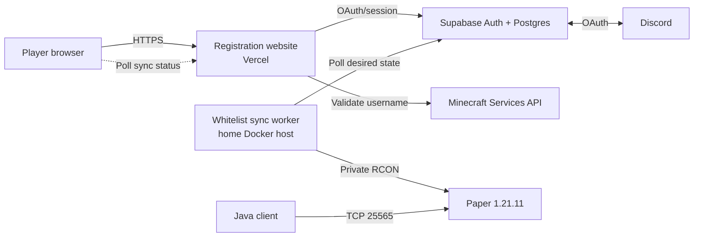

# Chulacraft

Chulacraft is a self-hosted Minecraft Java Edition server with a public,
Discord-authenticated registration website. Players sign in, register a valid
Java account, and receive whitelist access without exposing the Minecraft
server's administrative interface.

## Architecture

The system is split across managed public services and a private home server:



| Component | Location | Responsibility |
| --- | --- | --- |
| Next.js application | Vercel | Website, OAuth callback, profile validation, and registration API |
| Supabase Auth | Supabase | Discord identity and browser sessions |
| Supabase Postgres | Supabase | Durable registration state, RLS, uniqueness, and rate limiting |
| Whitelist worker | Home Docker host | Converts desired database state into Paper RCON commands |
| Paper server | Home Docker host | Minecraft 1.21.11 server, world, plugins, and enforced whitelist |

The database is the durable handoff between the public website and the private
server. Vercel never receives the RCON password, and the home server does not
need to accept inbound web requests.

## Registration lifecycle

1. A player opens the website and signs in through Discord.
2. Supabase creates the authenticated session and returns the player to
   `/auth/callback`.
3. The player submits a Minecraft Java username.
4. The Next.js API verifies the session, rate-limits the request, and resolves
   the official Minecraft UUID and canonical username.
5. A protected Supabase function creates the registration with
   `sync_status = pending`.
6. The private worker polls the registration, connects to Paper over
   Docker-internal RCON, and runs `whitelist add <username>`.
7. The worker records `synced` or schedules a retry; the website automatically
   displays the updated status.

One Discord user can own one registration, and a Minecraft UUID can belong to
only one registration.

## Repository layout

```text
.
|-- web/                         Next.js registration application
|   |-- src/app/                 Pages, OAuth callback, and API route
|   |-- src/components/          Landing and registration UI
|   |-- src/lib/                 Supabase clients and domain logic
|   `-- supabase/migrations/     Database schema, RLS, and RPCs
|-- minecraft/                   Private server stack
|   |-- compose.yaml             Paper and whitelist worker services
|   |-- Dockerfile               Paper 1.21.11 image configuration
|   |-- plugins/                 Managed plugin list
|   `-- whitelist-worker/        Supabase-to-RCON reconciliation worker
`-- IMPLEMENTPLAN/               Product and implementation planning material
```

Detailed documentation:

- [`web/README.md`](web/README.md) — web routes, data flow, security, configuration, and deployment
- [`web/OPERATOR_RUNBOOK.md`](web/OPERATOR_RUNBOOK.md) — launch, troubleshooting, recovery, and secret incidents
- [`minecraft/README.md`](minecraft/README.md) — Paper server, plugins, networking, and Docker operation
- [`web/supabase/README.md`](web/supabase/README.md) — database and RLS verification cases

## Trust and secret boundaries

| Environment | Allowed configuration | Must not be present |
| --- | --- | --- |
| Browser/Vercel web app | Supabase project URL, publishable key, public site URL, public server address | Supabase backend key, Discord secret, RCON password |
| Supabase | Discord provider credentials, auth data, registration records | RCON password |
| Minecraft host | Supabase backend key, RCON password, server configuration | Browser session data or Discord client secret |

RCON listens on the Docker network and localhost only. Public router forwarding
should expose Minecraft TCP `25565`, never RCON `25575`.

## Public hostname and DNS

The intended public hostname is `mc.ratchaphon.com` for both the website and
Minecraft Java. Because ordinary DNS does not route by port, Minecraft uses an
SRV record:

| Type | Name | Value | Proxy |
| --- | --- | --- | --- |
| CNAME | `mc` | Exact project CNAME supplied by Vercel | DNS only |
| A | `minecraft-origin` | Home server's public IPv4 address | DNS only |
| SRV | `_minecraft._tcp.mc` | Priority `0`, weight `0`, port `25565`, target `minecraft-origin.ratchaphon.com` | Not applicable |

Web browsers resolve `mc.ratchaphon.com` to Vercel. Minecraft Java clients first
discover the SRV record and connect to the home server on port `25565`. Players
should enter `mc.ratchaphon.com` without an explicit port.

Cloudflare's normal HTTP proxy does not proxy Minecraft port `25565`, so the
Minecraft origin record must remain DNS-only.

## First-time setup

### 1. Supabase

Create or select the Supabase project and apply:

```text
web/supabase/migrations/202607270001_minecraft_registrations.sql
```

Enable the Discord Auth provider. In the Discord Developer Portal, use:

```text
https://xtqpulleqbvoroxzheor.supabase.co/auth/v1/callback
```

In Supabase Auth URL Configuration, use:

```text
Site URL: https://mc.ratchaphon.com
Redirect URL: https://mc.ratchaphon.com/auth/callback
Local redirect: http://localhost:3000/auth/callback
```

### 2. Web application

Create `web/.env.local` from `web/.env.example`:

```env
NEXT_PUBLIC_SUPABASE_URL=https://YOUR_PROJECT_REF.supabase.co
NEXT_PUBLIC_SUPABASE_PUBLISHABLE_KEY=sb_publishable_REPLACE_ME
NEXT_PUBLIC_SITE_URL=http://localhost:3000
NEXT_PUBLIC_MINECRAFT_SERVER_ADDRESS=mc.ratchaphon.com
```

Then:

```powershell
Set-Location web
npm ci
npm run dev
```

For production, add the same public values to the Vercel project, set
`NEXT_PUBLIC_SITE_URL=https://mc.ratchaphon.com`, and redeploy.

### 3. Minecraft host

Create `minecraft/.env` from `minecraft/.env.example` and supply private values:

```env
RCON_PASSWORD=replace-with-a-strong-password
SUPABASE_URL=https://YOUR_PROJECT_REF.supabase.co
SUPABASE_SECRET_KEY=sb_secret_REPLACE_ME
```

Start the stack from the repository root:

```powershell
docker compose --env-file minecraft/.env -f minecraft/compose.yaml up -d --build
```

Inspect health and logs:

```powershell
docker compose --env-file minecraft/.env -f minecraft/compose.yaml ps
docker compose --env-file minecraft/.env -f minecraft/compose.yaml logs -f whitelist-sync
```

Persistent Paper data, world files, and plugin configuration live under
`minecraft/data/`.

## Verification

Verify the web project:

```powershell
Set-Location web
npm run lint
npm run typecheck
npm test
npm run build
```

Verify the worker:

```powershell
Set-Location minecraft/whitelist-worker
npm ci
npm run check
npm test
```

After deployment, complete one end-to-end smoke test:

1. Sign in with a real Discord account.
2. Register a valid, unclaimed Minecraft Java username.
3. Confirm the website moves from `pending` to `synced`.
4. Run `whitelist list` in the Paper console or through local RCON.
5. Join with `mc.ratchaphon.com`.

## Normal operation

- Start or rebuild: `docker compose --env-file minecraft/.env -f minecraft/compose.yaml up -d --build`
- Check service health: `docker compose --env-file minecraft/.env -f minecraft/compose.yaml ps`
- Follow worker logs: `docker compose --env-file minecraft/.env -f minecraft/compose.yaml logs -f whitelist-sync`
- Follow Paper logs: `docker compose --env-file minecraft/.env -f minecraft/compose.yaml logs -f minecraft`
- Stop services: `docker compose --env-file minecraft/.env -f minecraft/compose.yaml down`

Back up both the Supabase database and `minecraft/data/`. If the home host is
offline, registrations remain stored and the worker reconciles them after it
returns.
